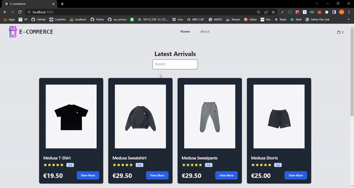

# Medusa Ecommerce Store





## About

### Participants

* Hasnain Sayyed - [GitHub](https://github.com/Hasnain01-hub) - [Twitter](https://mobile.twitter.com/hasnain93846614)
* Adil Khatri  -  [GitHub](https://github.com/adil-khatri) - [Twitter](https://twitter.com/khatriadil046)
* Ronak Lala  -  [GitHub](https://github.com/ronaklala) - [Twitter](https://twitter.com/ronaklala78564)
* Om Jadhav  -  [GitHub](https://github.com/omjadhav3714) - [Twitter](https://twitter.com/OmJadha24187157)


### Description

This is a complete eCommerce app built with Medusa.js, Next.js, Tailwind.

We have built an eCommerce Web App 
The basic plan for creation of the project was to create a online store for user convenient using medusa.

We had two options when it came to building this shop.

A website that allows people to buy  physical clothes over the internet rather than at a brick-and-mortar location. Through an e-commerce website, a business can process orders, accept payments, manage shipping and logistics, and provide customer service
 
In that way, we could share complete eCommerce store solutions with the open source community. Also, it helps us to test our framework with a real-world use case.

So basically, we built a complete eCommerce storefront by our own eCommerce template with nextjs-starter-medusa.

 The app includes the following features:
- Authentication & Authorization
- Product Listing
- Account information pages
- Product detail
- Shopping cart

### Preview


<!--                                                                 -->
   
                                                                              
                                                                   
## Set up Project   
### Prerequisites

- Minimum Node v16.0.0 
- [Medusa API](https://docs.medusajs.com/quickstart/quick-start)

### Install Project

Clone the project

```
git clone https://github.com/Hasnain01-hub/Ecommerce
```

Go to the project directory inside client folder, Install Medusajs globally.

```
npm install -g @medusajs/medusa-cli
```
```
npm install
```

Create your own medusa store locally inside client folder.

```
medusa new my-medusa-store --seed
```
This will create a my-medusa-store folder

```
cd my-medusa-store
develop medusa
```
This will start the medusa server on port 9000

### Running the development server inside client folder.

```bash
npm run dev
```

